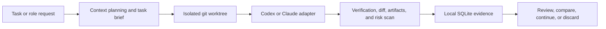

# Agent Hub

[中文说明](README_CN.md)

**A local runtime and control layer for coding agents.**

Agent Hub sits between a software task and coding agents such as Codex and
Claude Code. It gives each run the right context, an isolated git worktree, a
shared execution contract, and a reviewable evidence trail.

It is built for a practical question:

> How do you let coding agents work on a real repository without losing control
> of context, code changes, verification, memory, or delegation?

Agent Hub is local-first, and its core contribution is the agent runtime rather
than a chat interface. It does not require a cloud backend, accounts, remote
execution, or repository-wide agent configuration.

> Status: Agent Hub is in active development. The core agent execution,
> isolation, context, evidence, comparison, memory, and safety paths work today,
> but the project is not yet a stable production tool.

## The Problem

Running a coding agent is easy. Running one repeatedly and safely against a real
codebase is harder:

- The agent may receive too much context, too little context, or stale context.
- A run can modify the developer's current checkout before it is reviewed.
- Codex and Claude Code expose different process and event behavior.
- Logs, tests, diffs, artifacts, and risks are often scattered across tools.
- Multi-agent delegation can loop, duplicate work, or escape its intended scope.
- Long-term memory can silently turn an incorrect observation into future input.

Agent Hub turns those concerns into explicit local runtime stages and persisted
evidence.

## One Agent Run



The original project checkout is not used as the agent's working directory.
Every real run goes through the same local `TaskRunner` path, regardless of
which supported agent is selected.

## Core Agent Capabilities

### 1. One contract for different coding agents

Agent Hub defines a shared adapter boundary for detection and execution:

```ts
export interface AgentAdapter {
  kind: AgentKind;
  displayName: string;

  detect(): Promise<AgentDetectionResult>;
  run(input: AgentRunInput): AsyncIterable<AgentRunEvent>;
}
```

The current adapters are:

- `CodexAdapter`, which runs non-interactive `codex exec` inside the task
  worktree.
- `ClaudeCodeAdapter`, which runs non-interactive `claude --print` inside the
  task worktree.
- `FakeAgentAdapter`, which provides deterministic execution for tests and
  internal debug workflows.

The adapter boundary normalizes preflight detection, runtime input, streamed
stdout and stderr, lifecycle events, failures, and exit status without moving
orchestration logic into an agent-specific integration.

### 2. Context selection instead of prompt dumping

Agent Hub keeps canonical project context, approved memory, and reusable skills
in Agent Hub-owned storage. For each run, the context compiler builds a
task-specific context plan and task brief using:

- explicit task and role references;
- BM25 text retrieval;
- recency signals;
- code-graph relationships;
- optional local semantic retrieval and reranking hooks;
- deterministic selection, omission tracking, and compression.

The default delivery mode is `runtime_injection`: the selected brief and context
are sent to the adapter without writing agent files into the target repository.
An opt-in `worktree_overlay` can materialize generated files only inside the
isolated worktree. Repository export is a separate, previewed user action.

### 3. Worktree-isolated execution

Every task run receives its own git branch and worktree. The runner then:

1. prepares the task-specific runtime context;
2. starts the selected adapter with the worktree as `cwd`;
3. records streamed run events and final status;
4. executes configured verification commands;
5. collects the git diff and run artifacts;
6. generates a safety and risk report;
7. persists the complete run summary locally.

This makes a failed or low-quality run inspectable without contaminating the
developer's original checkout.

### 4. Bounded multi-agent delegation

Agent Hub models local workgroup roles and `RoleCall` delegation. A role can ask
another role to handle a bounded subtask only when its policy allows the target
and capability.

Delegation is checked for:

- caller and callee permissions;
- graph depth and fan-out limits;
- duplicate work;
- todo capacity;
- executor availability;
- dangerous command text.

Accepted executable role calls reuse the same isolated `TaskRunner` path as a
direct run. Role calls, todos, lifecycle events, and linked run evidence are
persisted for audit rather than hidden inside a single model response.

### 5. Evidence, comparison, memory, and safety

Agent Hub stores the evidence needed to judge an agent result:

- structured run events and logs;
- verification commands and results;
- bounded git diffs and artifacts;
- sensitive-path and dangerous-command findings;
- persisted risk reports;
- review decisions;
- comparisons between two runs of the same task.

Memory follows an explicit lifecycle:

```text
proposed -> approved -> eligible for future context
proposed -> rejected -> ignored
```

Agent output cannot silently become long-term memory. Approval writes accepted
memory to the Agent Hub-owned context store; proposed and rejected items remain
local SQLite evidence.

## What Works Today

| Area | Implemented behavior |
| --- | --- |
| Agent execution | Codex, Claude Code, and deterministic fake adapters behind one interface. |
| Isolation | Per-run git worktrees outside the original checkout. |
| Context | Task briefs, retrieval plans, selected context, omissions, compression, and local eval evidence. |
| Verification | Configured commands, captured output, structured results, and persisted run summaries. |
| Review evidence | Logs, events, diffs, artifacts, risk reports, review decisions, and run comparison. |
| Delegation | Policy-checked RoleCalls, role todos, bounded fan-out, and TaskRunner-backed delegated runs. |
| Memory | Propose, approve, reject, and inject approved memory. |
| Safety | Sensitive-path scanning, dangerous-command checks, risky-diff detection, and blocking risk levels. |

## Try an Agent Run

### Requirements

- Node.js 22 or newer
- pnpm 10.10.0
- Git
- Codex CLI and/or Claude Code CLI installed and authenticated for real runs

### Build from source

```sh
git clone https://github.com/LancherM/AgentHub.git
cd AgentHub
corepack enable
pnpm install
pnpm build
```

When working from the source checkout, define a small helper for the built CLI:

```sh
agent-hub-dev() {
  node "$PWD/apps/cli/dist/cli.js" "$@"
}
```

### Register a project and initialize context

```sh
agent-hub-dev project add --name my-app --root /path/to/my-app

agent-hub-dev context init \
  --project-root /path/to/my-app \
  --project-id <project-id>
```

By default, this creates Agent Hub-owned context storage outside the registered
repository.

### Run Codex or Claude Code

```sh
agent-hub-dev run --repo /path/to/my-app "@codex add the focused change"

agent-hub-dev run --repo /path/to/my-app \
  "@claude-code investigate the failing test"
```

### Inspect the evidence

```sh
agent-hub-dev runs list
agent-hub-dev runs show <run-id>
agent-hub-dev runs events <run-id>
agent-hub-dev runs diff <run-id> --stat
agent-hub-dev risks show <run-id>
```

Run the same task with two agents, then compare their persisted results:

```sh
agent-hub-dev compare \
  --task-id <task-id> \
  --baseline <codex-run-id> \
  --candidate <claude-run-id>
```

## Safety Boundaries

Agent Hub intentionally does not:

- run agents in the original project checkout;
- automatically merge agent-generated code;
- automatically push branches or create pull requests;
- approve generated memory automatically;
- store API keys or secrets in SQLite;
- write `AGENTS.md`, `CLAUDE.md`, `.claude/skills`, or `.agents/skills` into a
  repository unless the user explicitly previews and requests an export;
- add cloud sync, accounts, or remote task execution.

Sensitive paths such as `.env`, private keys, credentials, and token files are
flagged. Dangerous command patterns and high-risk diffs can produce blocking
risk reports that prevent automatic acceptance.

## Architecture

```text
Task or RoleCall
  -> Local Core
     -> Context Compiler
        -> context plan
        -> task brief
        -> runtime injection
     -> Task Runner
        -> git worktree
        -> Agent Adapter
           -> Codex / Claude Code / Fake Agent
        -> verification
        -> diff and artifacts
        -> risk report
     -> Local SQLite evidence
        -> review
        -> comparison
        -> memory proposal
```

The workspace keeps agent orchestration in reusable local packages:

```text
packages/
  core/                Domain models and application services
  db/                  SQLite migrations and repositories
  agent-adapters/      Codex, Claude Code, and fake adapters
  context-compiler/    Retrieval, task briefs, and runtime payloads
  task-runner/         Worktrees, execution, verification, and evidence
  safety/              Command, path, diff, and RoleCall policy checks
  shared/              Shared contracts and utilities
```

Agent orchestration, context selection, execution policy, and evidence
persistence belong to the shared local core rather than an interface layer.

For deeper product and implementation details, see
[`docs/product.md`](docs/product.md) and
[`docs/architecture.md`](docs/architecture.md).

## Development

```sh
pnpm typecheck
pnpm test
pnpm lint
pnpm build
```

The repository uses a pnpm TypeScript workspace, Vitest, Zod runtime validation,
SQLite through `better-sqlite3`, and git worktrees for execution isolation.

## Current Limitations

- Codex and Claude Code event mapping can become more structured.
- Some reserved local executor types are not implemented yet.
- Delegation and execution evidence still use metadata-backed storage in areas
  that may eventually justify first-class schema tables.
- Merge, push, pull-request, and branch-deletion workflows remain explicit
  non-goals for automatic agent execution.
